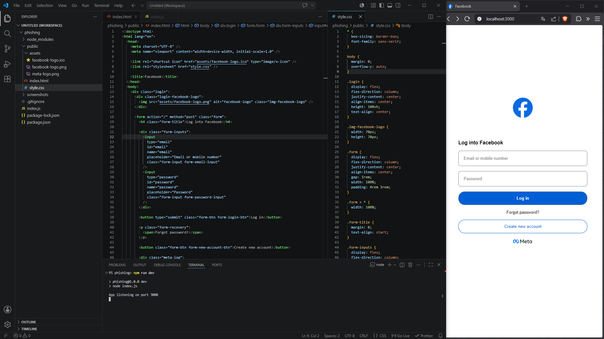
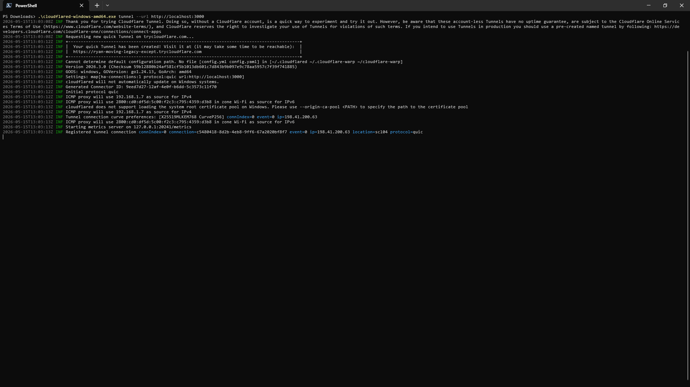
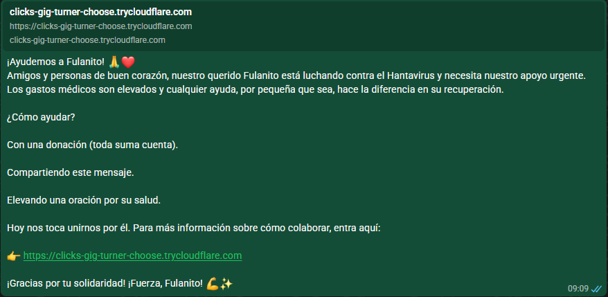

# Simulación de Phishing con Express + Cloudflared

## Descripción

Este proyecto consiste en una **simulación de phishing** desarrollada con fines educativos y de concientización en ciberseguridad.

El objetivo principal fue demostrar cómo puede exponerse una página falsa a Internet utilizando herramientas reales, permitiendo analizar riesgos, técnicas de ingeniería social y mecanismos de exposición web.

La simulación replica una interfaz de autenticación inspirada en plataformas reales con el objetivo de estudiar técnicas de ingeniería social utilizadas en campañas de phishing observadas en entornos reales.

> ⚠️ Este proyecto fue desarrollado exclusivamente con fines educativos y académicos.

---

## Tecnologías Utilizadas

- **Node.js**
- **Express.js**
- **HTML5**
- **CSS3**
- **Cloudflared**

---

## Interfaz de la Simulación

<p align="center">
  
</p>

---

## Arquitectura del Proyecto

El proyecto utiliza:

- **Express.js** como servidor backend.
- Archivos estáticos servidos desde Express:
  - HTML
  - CSS
  - Assets (iconos e imágenes)
- **Cloudflared** para crear un túnel seguro y exponer el servidor local a Internet mediante un enlace público temporal.

---

## Instalación del Proyecto

### 1. Clonar el repositorio

```bash
git clone https://github.com/m43c/phishing.git
cd phishing
```

### 2. Instalar dependencias

```bash
npm install
```

---

## Ejecutar el Proyecto

Iniciar el servidor:

```bash
npm run dev
```

Servidor local:

```bash
http://localhost:3000
```

---

## Instalación de Cloudflared

### Windows

Descargar Cloudflared desde la página oficial de Cloudflare:

https://developers.cloudflare.com/cloudflare-one/connections/connect-networks/downloads/

---

## Uso de Cloudflared

### Ubicación del ejecutable

Ubicar desde la terminal el ejecutable.

### Crear un túnel temporal

Con el servidor Express activo:

```bash
.\cloudflared-windows-amd64.exe tunnel --url http://localhost:3000
```

Cloudflared generará automáticamente un enlace público similar a:

```bash
https://random-name.trycloudflare.com
```

### Túnel Público Generado

<p align="center">
  
</p>

Ese enlace permitirá acceder al servidor local desde Internet mediante un túnel seguro.

---

## Flujo de la Simulación

1. El usuario accede al enlace público generado por Cloudflared.
2. Cloudflare redirige la solicitud hacia el servidor local.
3. Express procesa la solicitud y sirve los archivos estáticos.
4. El navegador renderiza la interfaz HTML y CSS de la simulación.
5. La página queda accesible públicamente mediante el túnel temporal.

---

## Vector de Distribución

La simulación contempla escenarios donde enlaces públicos pueden compartirse mediante plataformas de mensajería o redes sociales, replicando técnicas observadas en campañas reales de ingeniería social.

### Escenario donde se comparte el enlace publico

<p align="center">
  
</p>
---

## Funcionamiento General

1. Express levanta un servidor local.
2. El servidor entrega archivos HTML, CSS y assets estáticos.
3. Cloudflared crea un túnel seguro hacia el servidor local.
4. Cloudflare genera un enlace público temporal accesible desde Internet.

---

## Objetivo Educativo

Esta simulación busca:

- Comprender cómo funcionan los ataques de phishing.
- Analizar técnicas de ingeniería social.
- Estudiar métodos de exposición web.
- Entender el funcionamiento de túneles públicos.
- Promover la concientización en ciberseguridad.

---

## Características Implementadas

- Servidor backend con Express.
- Servicio de archivos estáticos.
- Interfaz frontend en HTML y CSS.
- Exposición pública mediante Cloudflared.
- Simulación visual de portal de autenticación.

---

## Limitaciones

- Proyecto únicamente demostrativo.
- No incluye almacenamiento real de credenciales.
- No se implementan mecanismos ofensivos.
- No se automatizan ataques reales.

---

## Recomendaciones de Seguridad

- Verificar siempre los dominios antes de ingresar credenciales.
- Utilizar autenticación multifactor (MFA).
- Evitar abrir enlaces sospechosos.
- Capacitar usuarios sobre ingeniería social.
- Revisar certificados HTTPS y URLs oficiales.

---

## Licencia

Este proyecto se distribuye únicamente con fines educativos y académicos.

El autor no se responsabiliza por usos indebidos del código o modificaciones realizadas por terceros.
